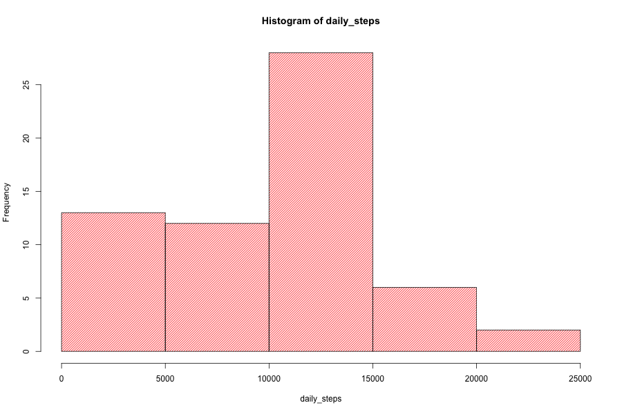
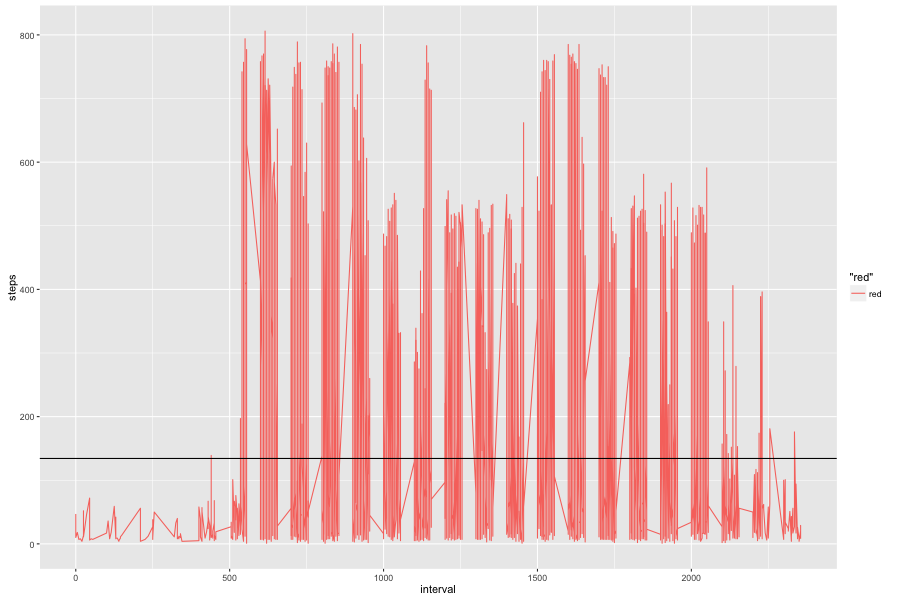
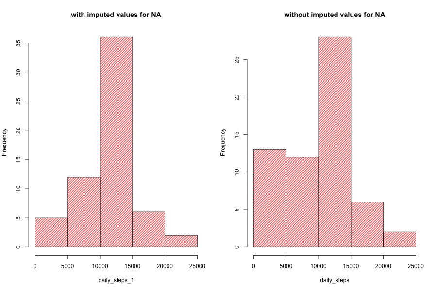
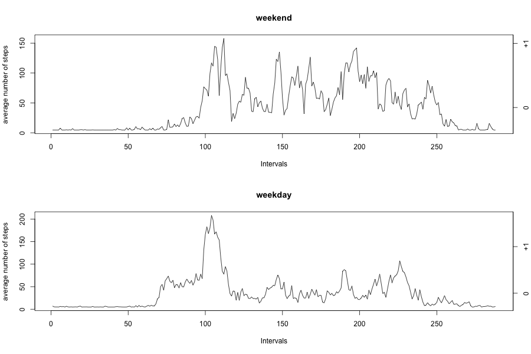

## Loading and preprocessing the data
This assignment makes use of data from a personal activity monitoring device. 
The data is collected at 5 minute intervals through out the day. 
The data consists of two months of data from an anonymous individual collected during the months of October and November, 2012 and include the number of steps taken in 5 minute intervals each day.
The data for this assignment can be downloaded from:
 (https://d396qusza40orc.cloudfront.net/repdata%2Fdata%2Factivity.zip) [52K]
 
The variables included in this dataset are:
steps: Number of steps taking in a 5-minute interval (missing values are coded as  NA ) 
date: The date on which the measurement was taken in YYYY-MM-DD format 
interval: Identifier for the 5-minute interval in which measurement was taken

The dataset is stored in a comma-separated-value (CSV) file and there are a total of 17,568 observations in this dataset.

First.  load the libraries. 
Second. download the file, previously check if the file already exists
Third.  unzip the downloaded zip file
Fourth. load the file into a new data frame "activity"

```{r, echo=TRUE}
## Loading libraries
library(dplyr)
library(ggplot2)
## Download file and unzip to working directory
if(!file.exists("repdata-data-activity.zip")) {
  download.file("https://d396qusza40orc.cloudfront.net/repdata%2Fdata%2Factivity.zip", destfile = "repdata-data-activity.zip")
  unzip("repdata-data-activity.zip")
}
## Loading the data - reading the Activity File
activity <- read.table("activity.csv", header = TRUE, sep = ",")
```

## What is mean total number of steps taken per day?
We create a new data frame eliminating the NA values.
In order to create the histogram and generate the corresponding mean. 
We added the median to complement the information.
.
The mean total number of steps taken per day is 9354.



```{r, echo=TRUE}
## Create the daily data without NA
daily_steps <- with(activity, tapply(steps, date, sum, na.rm = TRUE))
## Plot the Histogram for total number of steps per day
png(filename = "plot1.png", width = 900, height = 600, bg = "white")
hist(daily_steps, col = "red", density = 30, border = "black")
dev.off()
## Mean and Median
median_mean <- summary(daily_steps)
print(median_mean[3:4])
```

## What is the average daily activity pattern?
I decided to exclude the intervals with zero steps in order to analyse only the intervals with actual walking activity.
Used ggplot2 to generate the plot that shows the activity pattern.
The first few hundred intervals showed a lower activity level 


```{r, echo=TRUE}
## Create the data to generate the Time Series for the Intervals
intervals_data <- subset(activity, steps > 0, select = c(steps, interval) )
## Plot the Time Series for the Intervals
png(filename = "plot2.png", width = 900, height = 600, bg = "white")
g <- ggplot(intervals_data, aes(x = interval, y = steps, col = "red")) 
     g  + geom_line() + geom_hline(yintercept = mean(intervals_data$steps))
ggsave("plot2.png")     
dev.off()

```


## Imputing missing values
I decided to use the average interval value across all days, as the value to impute for the corresponding interval without value.

```{r, echo=TRUE}
## Imputing Missing Values
## If any interval has a NA it is replace by the average of the interval for all dates.
## creating the new dataset "activity_1" 
activity_1 <- activity
  upper_bound <- nrow(activity_1)
for (i in 1:upper_bound ) {
  if (is.na(activity_1[i,1])) {
    activity_1[i,1] <- mean(activity_1[,1], na.rm = TRUE)
  }
} 

```


## Are there differences in activity patterns between weekdays and weekends?
The first histogram corresponds to the differences between imputed and no imputed data. The difference is more evident in the first half of the intervals.

The second histogram shows the behaviour during weekdays and weekends, as expected there is more activity durig the weekend.



```{r, echo=TRUE}
## Create an Histogram similar to the first question to the new dataset
## To compare results
daily_steps_1 <- with(activity_1, tapply(steps, date, sum, na.rm = TRUE))
png(filename = "plot3.png", width = 900, height = 600, bg = "white")
par(mfrow=c(1,2))
hist(daily_steps_1, col = "red", density = 30, border = "black", main = "with imputed values for NA")
hist(daily_steps, col = "red", density = 30, border = "black", main = "without imputed values for NA")
dev.off()
##
## Create a new column "week_day" class factor with 2 levels "weekend" and "weekday" 
for (i in 1:upper_bound ) 
  ifelse( (weekdays(as.Date(as.character(activity_1[i, 2]))) == "Saturday") || 
            (weekdays(as.Date(as.character(activity_1[i, 2]))) == "Sunday"),
          activity_1$week_day[i] <- "weekend" , 
          activity_1$week_day[i] <- "weekday" )
## Means and standard deviation for weekday and weekend
week_day_mean <- subset(activity_1, week_day == "weekday")
week_end_mean <- subset(activity_1, week_day == "weekend")
week_day_stat <- with(week_day_mean, tapply(steps, interval, mean, na.rm = TRUE))
week_end_stat <- with(week_end_mean, tapply(steps, interval, mean, na.rm = TRUE))
mean_weekday <- mean(week_day_mean$steps)
mean_weekend <- mean(week_end_mean$steps)
sigma_weekday<- sd(week_day_mean$steps)
sigma_weekend<- sd(week_end_mean$steps)
## Plotting
## Ticks for y axis weekday
tick_wd_1 <- mean_weekday - 1*sigma_weekday
tick_wd_2 <- mean_weekday
tick_wd_3 <- mean_weekday + 1*sigma_weekday
tick_wd_4 <- mean_weekday + 2*sigma_weekday
## Ticks for y axis weekend
tick_we_1 <- mean_weekend - 1*sigma_weekend
tick_we_2 <- mean_weekend
tick_we_3 <- mean_weekend + 1*sigma_weekend
tick_we_4 <- mean_weekend + 2*sigma_weekend
## Plot weekdays and weekends
png(filename = "plot4.png", width = 900, height = 600, bg = "white")
par(mfrow=c(2,1))
plot(week_end_stat, type = "l", main = "weekend", xlab = "Intervals", ylab = "average number of steps")
axis(4, at= c(tick_we_1, tick_we_2, tick_we_3, tick_we_4), labels = c("-1", "0", "+1", "+2"))
plot(week_day_stat, type = "l", main = "weekday", xlab = "Intervals",ylab = "average number of steps")
axis(4, at= c(tick_wd_1, tick_wd_2, tick_wd_3, tick_wd_4), labels = c("-1", "0", "+1", "+2"))
dev.off()
```


